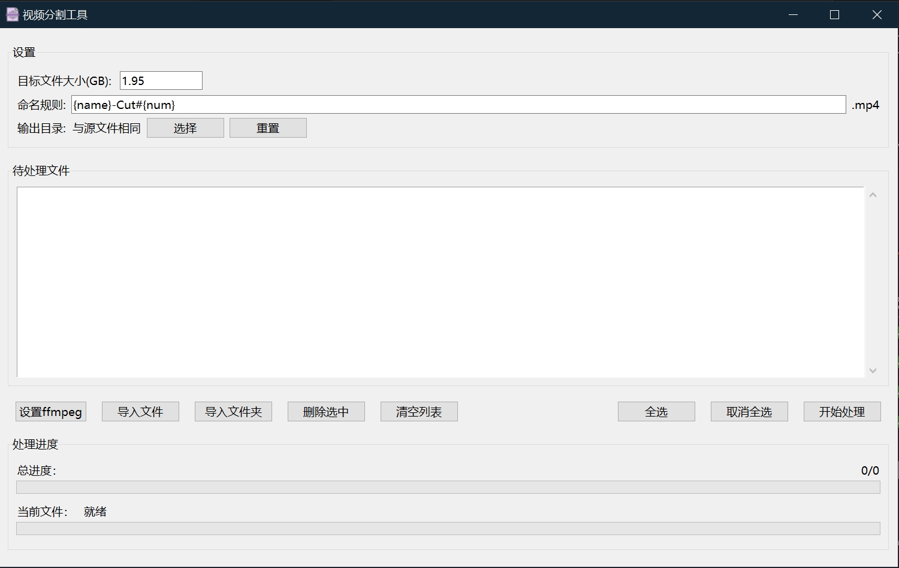

<div align="center">

<h1 align="center">VSplitter</h1>

✨ 一个基于Python+FFmpeg的快速视频分割GUI工具 ✨
</div>

## 🔑 如何使用？
0. 前往[Release](https://github.com/SaKongA/VSplitter/releases)下载预构建VSplitter压缩包，解压至空闲目录；
1. 双击`VSplitter.exe`，托入目标视频文件即可使用！

## 📌 注意事项
1. 本工具仅支持Windows平台，其他平台暂不支持
2. 本工具暂时仅支持Mp4格式的视频文件
3. Telegram限制普通用户上传单文件最大2GB，分割文件大小建议设置为1.95GB（默认值）

## 🔨 从源码临时启动项目
0. 确保设备已经安装[Python](https://www.python.org/)与[Pypi](https://www.python.org/)
> 注意：Python 2.7.9 + 或 Python 3.4+ 以上版本都自带 pip 工具。

1. 安装项目所需依赖
```bash
> pip install tkinterdnd2
```

2. 前往[FFmpeg官网](https://ffmpeg.org/download.html)下载Windows平台的FFmpeg压缩包，解压至空闲目录  

3. 启动项目
```bash
> python main.py
```

4. 选择FFmpeg可执行程序所在目录，即解压缩后的`ffmpeg/bin`文件夹，点击确定，即可使用！

## 🔨 从源码构建项目
0. 确保设备已经安装[Python](https://www.python.org/)与[Pypi](https://www.python.org/)
> 注意：Python 2.7.9 + 或 Python 3.4+ 以上版本都自带 pip 工具。

1. 安装项目所需依赖
```bash
> pip install tkinterdnd2 pyinstaller
```

2. 配置FFmpeg  
2.1 前往[FFmpeg官网](https://ffmpeg.org/download.html)下载对应平台的FFmpeg压缩包，解压，更名文件夹为`ffmpeg`；
2.2 更名后文件夹结构应该与下方严格一致，最后将ffmpeg文件夹放到`main.py`同一文件夹下：
```
ffmpeg/
├── bin/
│   ├── ffmpeg.exe
│   ├── ffprobe.exe
│   └── ffplay.exe
├── doc/
└── presets/
```

3. 打包程序
```bash
> python build_exe.py
```

4. 打包成功后，在`dist`文件夹下会生成工具程序文件夹，包含可执行程序，无需额外安装Python依赖和配置FFmpeg

## 📌 已完成的功能
  
| 状态 |          功能               |
|:--------:|:-------------------------------:|
|    ✅     | 自定义分割文件大小                |
|    ✅     | 过滤不符合大小要求的文件         |
|    ✅     | 拖入文件添加                 |
|    ✅     | GUI操作界面                |
|    ✅     | 自定义文件命名规则                |


## 🎴 截图
<div align="center">
	
</div>

## 🧤 支持
* 欢迎前往[Issue](https://github.com/SaKongA/VSplitter/issues)提出您遇到的任何问题；
* 如果您对我的项目感兴趣，需要更多帮助与支持，再或需要完善其他功能，欢迎联系我！